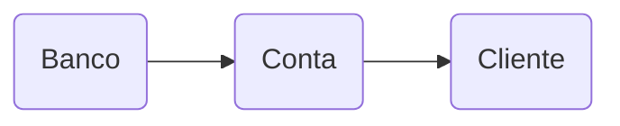

# POO - Classes Banco, Conta e Cliente

Projeto acadêmico em **Java** da matéria de Programação Orientada a Objetos. Programa desenvolvido com o objetivo de aprender os conceitos de **POO** utilizando as classes Banco, Conta e Cliente, criando atributos, métodos e construtores para cada classe, utilizando o objeto da classe Banco como atributo da classe Conta, e utilizando o objeto da classe Conta como atributo da classe Cliente.

